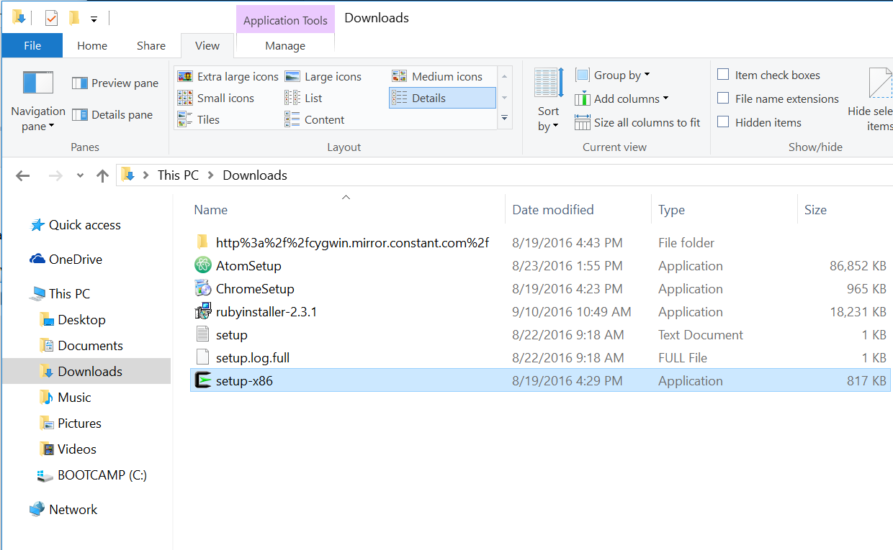
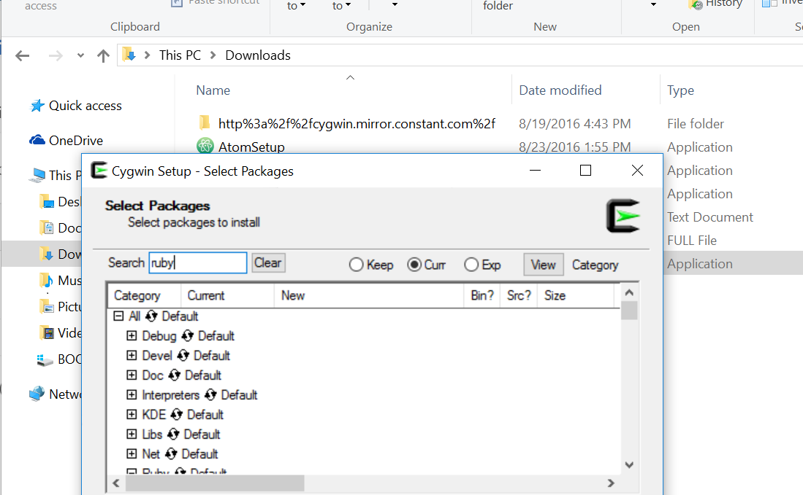
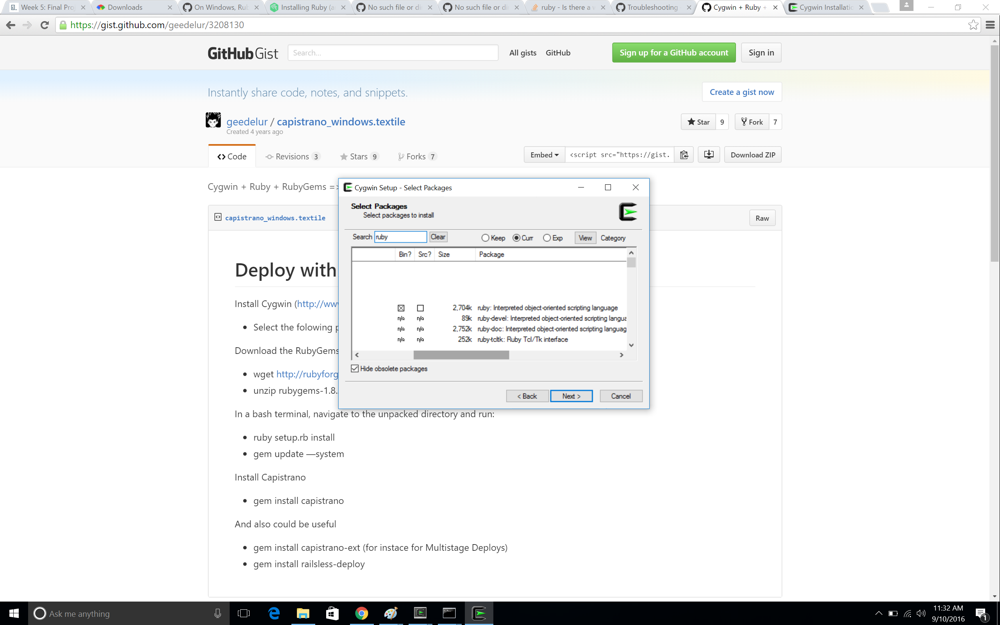
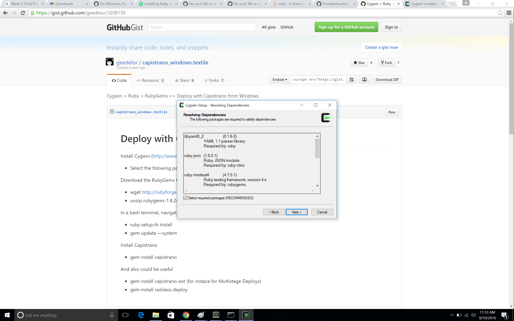
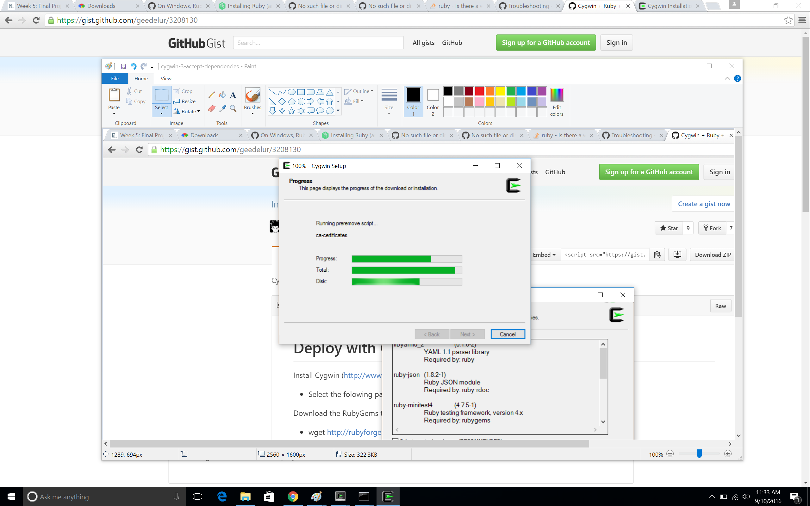
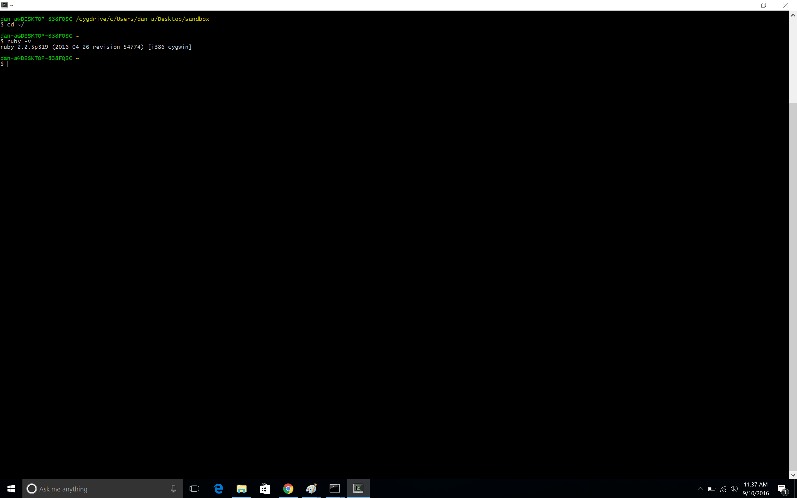

# Install Ruby on Cygwin

### STEP 1: Run **setup-x86**
Go to **downloads** and find **setup-x86** and double-click to run.



When prompted to _allow this app to make changes_, choose _Yes_.

### STEP 2:
Continue through each window prompt ...  

1. Choose a Download Source: _Install from Internet_
2. Select Root Install Directory: **C:\cygwin**
3. Select Local Package Directory: **C:\Users\<Your-name>\Downloads**
4. Select Your Internet Connection: _Direct Connection_
5. Choose a Download Site: **http://cygwin.mirror.constant.com**

 ... until you hit _Select Packages._ Here search for _ruby_ and then select _Interpreters_.  

 

### STEP 3: Select newest ruby version
Select the Ruby package at the top: _ruby: Interpreted object-oriented scripting language_



### STEP 4: Accept Ruby Dependencies

The next prompt will ask if you'd like to resolve ruby dependencies. Yes, yes you would.



### STEP 5: Install Ruby

Let Cygwin do its thing and install ruby ...



**NOTE**: if Cygwin is open, the installer may prompt you to _kill_ or _stop_ processes which are interfering with the installation. Choose _Yes_.

### STEP 6: Verify that Ruby is in fact installed

Launch your Cygwin application and enter `ruby -v` on the command line. Your output should look like this:

```bash
ruby 2.2.5p319 (2016-04-26 revision 54774) [i386-cygwin]
```



### STEP 7: Rejoice


