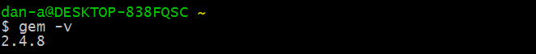
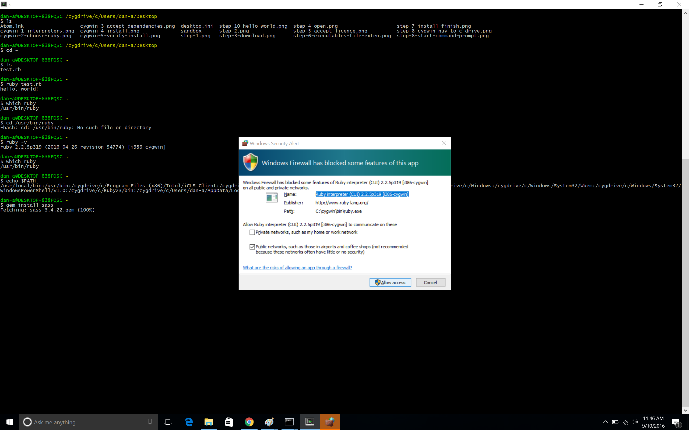
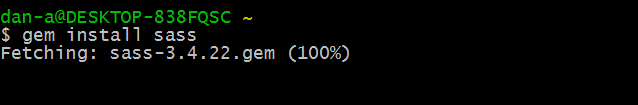
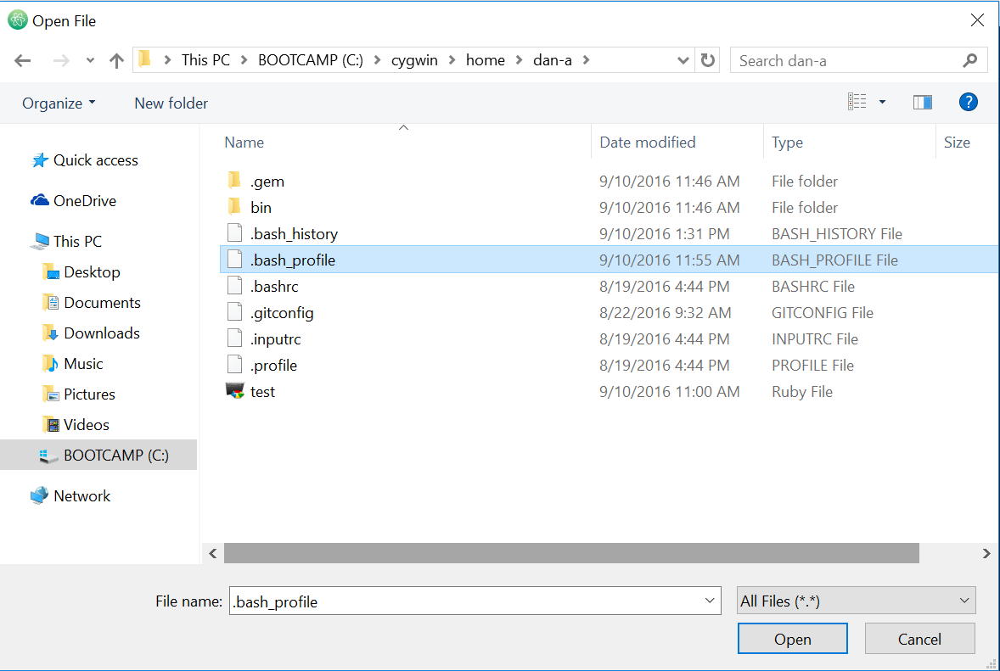

# Install Sass with Cygwin

### STEP 1: Verify that you have Ruby Gems

From your Cygwin command line, enter:

```bash
gem -v
```

You should see the following output:



### STEP 2: Install the Sass Gem

Make sure you are in your Cygwin home directory (this is the directory that Cygwin opens in by default when you launch the Cygwin app). From the command line, enter:

```bash
gem install sass
```
Your computer will ask you if you want to allow this installation. _Yes_, you do.



Cygwin will start installing Sass ...



When the install is complete, Cygwin will output something like:

`1 gem installed`

### STEP 3: Add the new **bin** directory to your `PATH` environment variable

When we installed Sass, the Sass commands were all written to a new directory called **bin**. This directory is located in your Cygwin **home** directory. You can see this location by typing `pwd` on the Cygwin command line. The output will be:  

```bash
/<your-name>/home
```
 This is where you are when you first launch the Cygwin application.

 Type `ls -a` and you will see a _hidden_ file called **.bash_profile**. We need to add some code to this file now to make sure that when we type Sass commands, Cygwin and your Windows operating system will recognize them.

 Using your code editor, open **C:cygwin\home\<your-name>\.bash_profile**:

 

 Your **.bash_profile** file looks something like this . . .

 ```bash
 # To the extent possible under law, the author(s) have dedicated all
 # copyright and related and neighboring rights to this software to the
 # public domain worldwide. This software is distributed without any warranty.
 # You should have received a copy of the CC0 Public Domain Dedication along
 # with this software.
 # If not, see <http://creativecommons.org/publicdomain/zero/1.0/>.
 ...
 ```
Lines beginning with `#` are comments.

At about line 26 in your **.bash_profile**, add this code:

```bash
PATH=~/bin:$PATH
```

Then save your **.bash_profile**, close your Cygwin application and relaunch it. When you relaunch Cygwin, the new code will be executed and you will have access to Sass commands from the command line. If you'd like to see a complete copy of the **.bash_profile** file for reference, [click here](.bash_profile).

### STEP 4: Verify that Sass Commands are Working

From your command line, enter the following command to verify that Sass is ready to go:

```bash
sass -v
```
The output should be:

```bash
Sass 3.4.22 (Selective Steve)
```
### STEP 5: Follow the week 5 project instructions as before!

Nice work!


